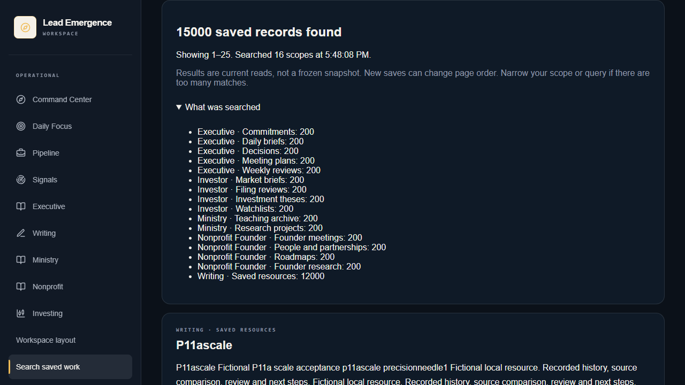
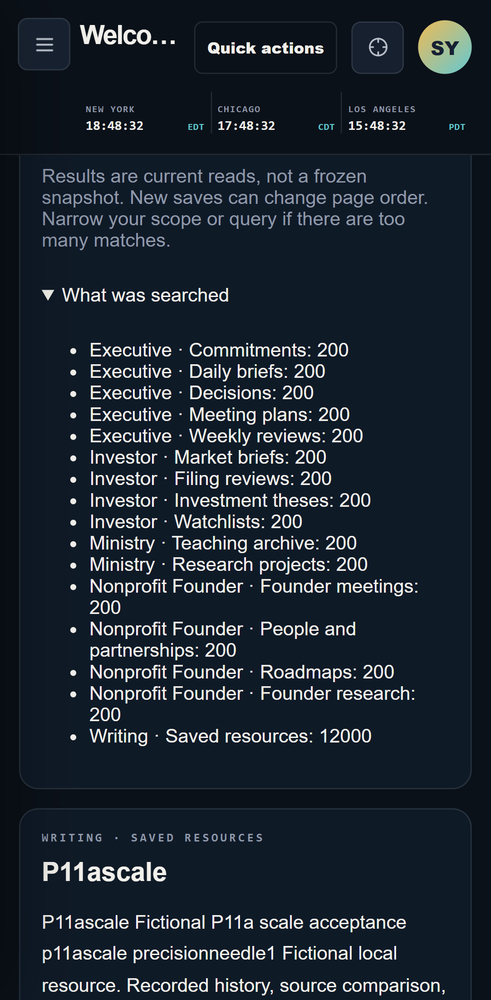

# P11a — Large-library saved-work search

2026-09-09. Implementation checkpoint, not a client release.
**All six bundles remain NOT READY TO SHIP.**

## Milestone, repositories and architecture

P11a reduces avoidable source-text preparation in native saved-work search.
It preserves the same sixteen scopes, exact counts, ranking, result metadata,
plain-text preview content and native-only authority checks. The first
25 ranked rows are chosen before preparing their source text.

Host: abostwick12/lead-emergence-workspace, owned branch
`codex2/bundle-experience-integration`.
Starting HEAD: bd4dc007f19903eaebe1171a743ac199ae61711e.
Source: abostwick12/lead-emergence-bundles, owned branch
`codex2/bundle-platform-v1`.
Starting HEAD: c016b2d34ee7817909049d6305190dade1ca7d1e.
Published source documentation HEAD: 4f40fa72bfe03b513d049de817b12e70471a6d10.
Only source evidence documents change. Bundle Contract 1.0, UI Manifest
Contract 1.0 and Workspace Experience 0.3.0 remain unchanged. The host's
32-file export stays pinned to afb0e0386c446f51e3e8a70b641e2c5c69b9240b.

See [the query boundary and primary PostgreSQL documentation](../architecture/workspace-saved-search.md#page-bound-preview-work-p11a).
Migration 34 changes only the existing native search function. There is no
new shared corpus, table, model capability, entitlement or provider connection.
Counts and ranking still consider every match; pagination is still limited
to 10,025 accessible matches with an explicit narrowing instruction.

## Controlled before/after experiment

The same local owner has 12,000 Writing resources and 200 records in each
of fifteen structured kinds (15,000 scale records total). Another fictional
owner has 500 control resources. Earlier fixtures are preserved. The scale
corpus contains 119,653,394 logical body/JSON bytes; that is not physical
database size. Most long records contain repeated fictional text and are
not a substitute for representative human-written resources.

The original function was measured before applying migration 34. Each
phase made 66 real authenticated loopback RPC calls: eleven cases, one
first read plus five measured repeats. The five-repeat median is p50;
nearest-rank p95 here is simply the maximum of those five samples. These
are controlled single-user local observations, not a statistically robust
tail-latency estimate, cold-cache measurement, load test or production SLA.
The first read was not asserted to have a cold database or OS cache.

All eleven complete result fingerprints match before/after, excluding
only retrievedAt. Fingerprints include owner/authority, result order,
original IDs, snippets, revisions, timestamps, match reasons, counts,
coverage, query and offset. Only hashes, fixture queries and timing totals
are published, not private response payloads or credentials.

| Case | Matches | Before p50 ms | After p50 ms | Before p95 ms | After p95 ms |
| --- | ---: | ---: | ---: | ---: | ---: |
| all_first | 15000 | 707.5 | 174.2 | 750.4 | 180.8 |
| all_deep | 15000 | 910.8 | 204.5 | 1132.4 | 233.7 |
| writer_broad | 12000 | 255 | 123.3 | 274.1 | 126 |
| writer_selective | 1 | 51.6 | 49.8 | 52.9 | 59 |
| writer_phrase | 12000 | 842.3 | 699.1 | 900.1 | 722 |
| ministry_research | 200 | 27.8 | 23.5 | 28.9 | 24.5 |
| nonprofit_meetings | 200 | 26.4 | 22.8 | 29.1 | 23.7 |
| investor_theses | 200 | 31.8 | 25.2 | 34 | 25.4 |
| executive_briefs | 200 | 27.2 | 24.7 | 27.7 | 25.3 |
| no_matches | 0 | 66.3 | 72.2 | 69.7 | 81.2 |
| foreign_control | 0 | 66.2 | 66 | 84.9 | 78.8 |

All 132 RPC calls completed without error. Every after-phase warm maximum
was below the explicit local 2,000 ms gate. Broad first-page median fell
75.4%; deep-page median fell 77.5%. This is not a claim that every query
became faster: no-match median increased from 66.3 to 72.2 ms, and the
selective Writer maximum increased from 52.9 to 59 ms.

A separate authenticated EXPLAIN (ANALYZE, BUFFERS) of the broad first
page changed from 774.999 to 184.063 ms. Aggregate temporary reads changed
from 307,972 blocks to zero; writes from 18,116 blocks to zero.
These are query-plan buffer counters, not measured physical disk traffic
or a total-memory profile. Ranking remains real work.

[Raw samples, counts, response hashes and plan totals](search-scale-proof/measurements.json)
are part of this checkpoint.

## Test ledger

- PASS: existing named local database upgraded to 34 migrations.
- PASS: brand-new bundle-search-fresh-p11a database replayed all 34 migrations;
  650 assertions across 20 database suites passed; zero users retained.
- PASS: the same 650 rollback-only assertions on the upgraded database.
- PASS: 299 host unit tests in 32 files, including four new SQL structure/
  guard-regression checks; 32 schema-policy checks; 261 runtime boundary checks.
- PASS: host typecheck, lint and optimized build (54 static pages).
- PASS: eight real native HTTP/RPC groups, including independent searches of
  all sixteen saved-work kinds, complete two-page 47-record baseline retrieval,
  owner exclusion, forged/malformed inputs, stale authority, mid-pagination
  revocation and access restoration.
- PASS: three real OAuth/MCP groups. All-five domain toolsets compose;
  an actual all-six-assigned OAuth bearer is denied shared native search
  through both direct RPC and HTTP. Temporary fictional grant disconnected.
- PASS: twenty optimized Chrome desktop/mobile-emulated journeys in 52.6
  seconds, zero retries. Sixteen existing search/action journeys plus four
  large-library journeys: full counts and 16-scope coverage, 25-card pages,
  distinct next page, narrow one-record match, explicit paging limit, foreign
  controls invisible, recovery to broad search and no horizontal overflow.
- PASS: source typecheck, 134 tests in 13 files, all six official plugin
  validations and all six skill validations; contracts/packages unchanged.
- PASS: two scale screenshots individually inspected; fixture data only.
- PASS: all 32 transformed portable exports and SHA-256 hashes match the
  unchanged source pin; narrow credential scan passed for all 15 changed
  files across both repositories, including packaged evidence. This is not
  a historical secret or comprehensive privacy audit.
- Branch publication is recorded
  in the accompanying final checkpoint after commits.

The previous 146-journey whole-bundle browser run belongs to P11, not P11a.
It was not repeated here: this checkpoint changes the native query and
verification tooling, with no application UI or JavaScript behavior change.
The optimized search tests exercise existing scope, links, access, error,
late-response, keyboard and shortcut behavior after the SQL change.

The previously observed 31-second mobile keyboard case did not recur in
this run (2.0 seconds; desktop 1.9 seconds). That does not establish the
cause or prove the intermittent issue eliminated.

## Implemented files and reproduction

- Migration: `supabase/migrations/20260912140000_workspace_search_page_previews.sql`.
- Explicit fictional scale seed and before/after runner:
  `scripts/seed-search-scale-local.mjs`, `scripts/test-search-scale-local.mjs`.
- Fresh replay runner now accepts a validated explicit suffix and still
  refuses existing named directories/volumes; it never resets them.
- SQL guard/structure tests and `tests/e2e/search-scale-connected.spec.ts`.
- Package commands, query architecture, this ledger and packaged samples/
  screenshots. Source readiness/discovery documents reference host evidence.

Use only the exact isolated fictional stack validated by
`scripts/bundle-local-runtime.mjs`: project bundle-experience-p2,
API http://127.0.0.1:58521, app http://localhost:3125. The scale seed expects
the P11 fictional domain fixtures for all fifteen kinds. It refuses an
unexpected partial corpus and never overwrites an existing scale fixture.

Run `npm run seed:search:scale`, then
`npm run test:search:scale -- before` on migration 33 before upgrading.
After the local upgrade, run `npm run test:search:scale -- after`.
An after run requires its matching before report. Do not downgrade or
reset an existing database to recreate the baseline; prepare a separately
named isolated environment from the baseline revision instead.
Reports and account/config inputs remain in ignored .bundle-local.

Fresh verification: `npm run test:search:fresh -- <unused-simple-suffix>`.
It uses a separate local database on 58620–58627, requires free ports and
preserves its stopped backup. A previously used suffix intentionally fails.

For optimized browsers, enable SEARCH_LOCAL_ACCEPTANCE and
SEARCH_SCALE_LOCAL_ACCEPTANCE, use E2E_BASE_URL http://localhost:3125,
and run both search-connected and search-scale-connected specs.
OAuth/MCP checks use the local development preview because the optimized
production host guard correctly rejects loopback MCP hosts; no forged Host
header bypass is used.

## Corrected verification attempts

The first static guard-comparison test used an ambiguous declaration marker
and accidentally extracted the earlier catalog function. The test failed;
the marker was made specific to search, with nonempty guard assertions, and
all 299 tests passed. A staged whitespace check later found one copied blank
line with trailing spaces in migration 34; those spaces were removed without
changing SQL behavior. Neither failed check is represented as a passing run.

## Security, platform findings and remaining gates

The same native session, derived owner, Workspace Experience assignment,
all selected per-kind capabilities and current authority revision are
required. Private profiles and unsaved drafts stay excluded. Page previews
repeat owner and primary-key restrictions; structured documents also match
kind. The existing HTTP layer remains strict, private/no-store and bounded.
No assistant source sharing, query history, publishing, booking or outgoing
provider action is introduced.

Final local aggregate audit: 34 migrations, 19 fictional users, zero
non-fictional users, sixteen admitted search scopes, zero Executive record/
task shares, four preserved pre-existing MCP grants and zero new active
grants. The fresh and main fictional databases are stopped with backups preserved;

both development and optimized previews are stopped. No material data was
deleted. Final publication heads are recorded in the accompanying checkpoint.

No OpenAI API, plugin format, MCP protocol, installed-host behavior or source
export changed. Official PostgreSQL guidance informed query materialization;
no OpenAI-specific change or new compatibility claim was needed.

NOT RUN: representative-client source quality or unaided time-saved study,
concurrent-client load, cold-cache/deployed latency, complete memory profiling,
installed ChatGPT/Codex acceptance, authorized external providers, hosted
migration, deployed recovery/rollback/privacy/retention, payment enforcement
or marketplace publication. Existing approval boundaries remain in force.
Only the owned branches may be published; neither main is merged, repository
visibility changed, nor any production or client account touched.

Next: shared attention and connection/notification center, grounded
approval-only layout proposals, remaining domain ingestion/recovery work,
then representative and authorized installed/deployed shipment gates.
