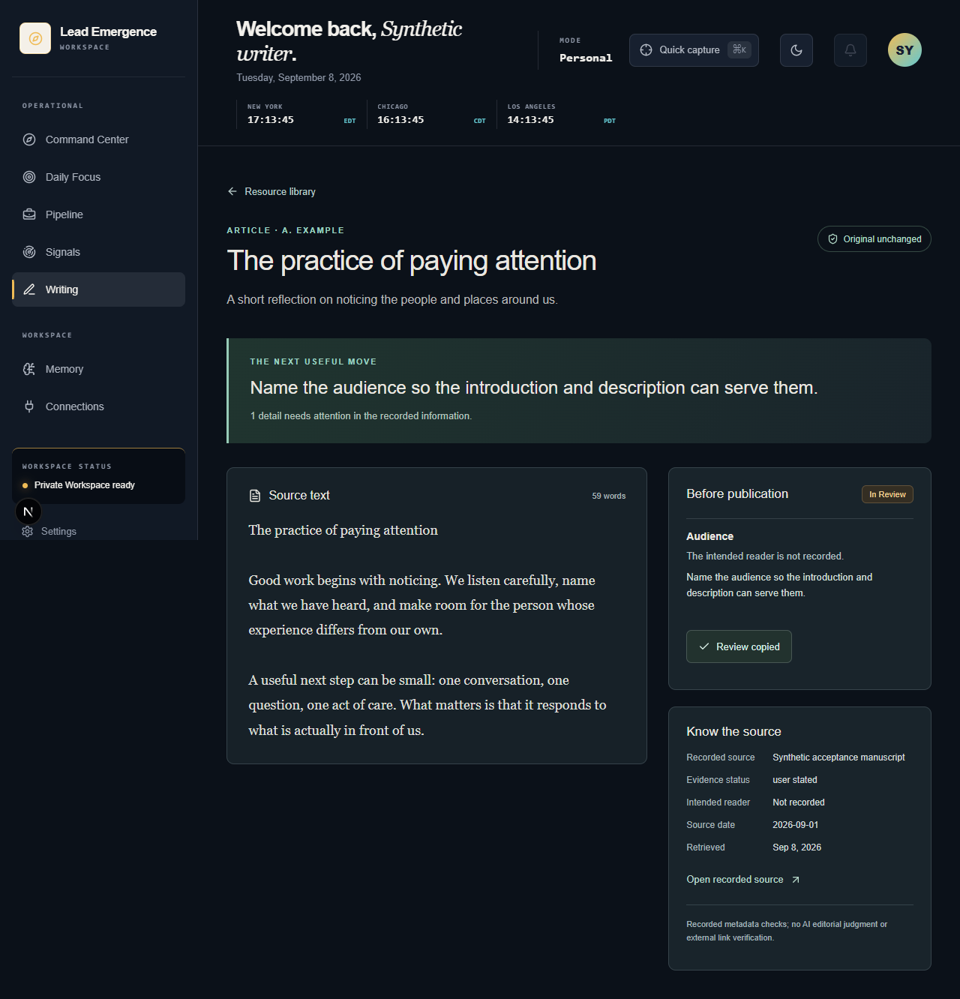
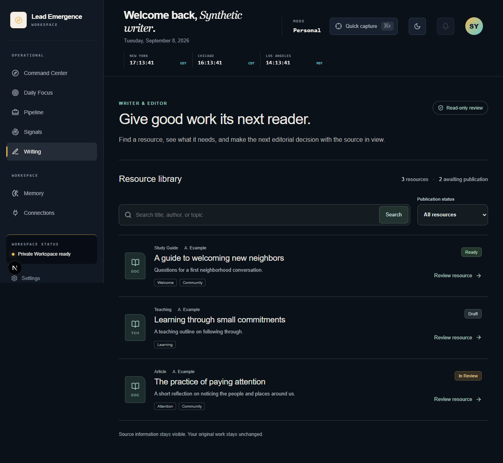
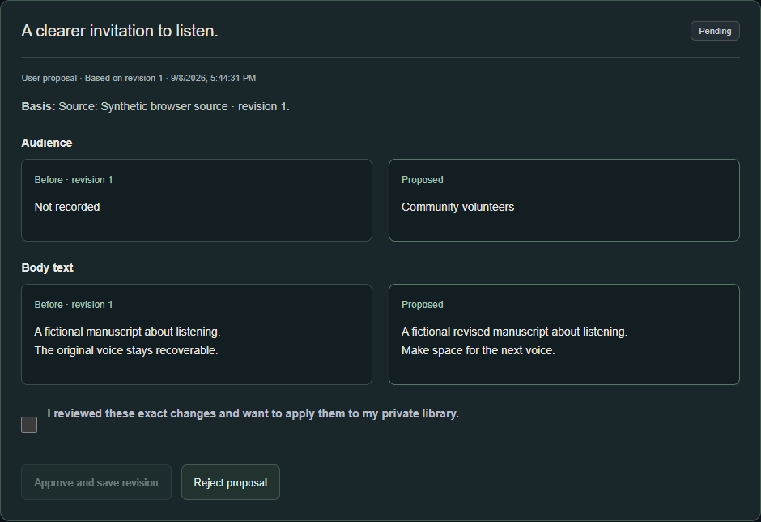
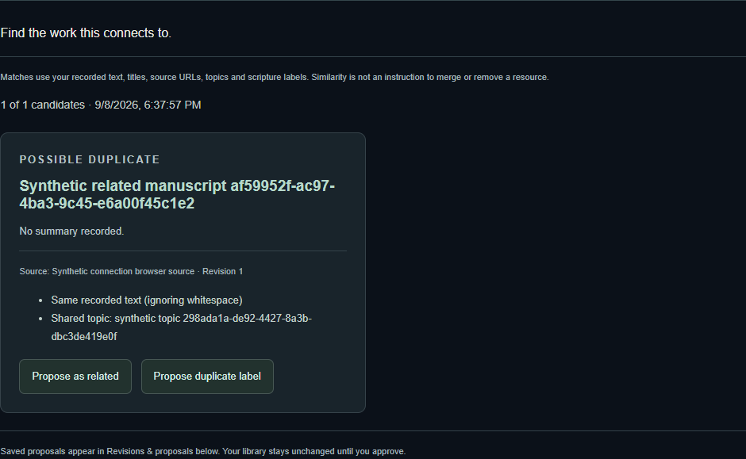

# Writer proof — tested screens

The first Writer slice is built and locally validated. These screens use fictional
resources. They show the actual application, not a design mockup.

## Resource review

The original text remains beside its recorded source, the missing editorial
information, and a clear next decision. Copying review notes changes nothing.

## Resource library

Search by title, author, or topic; filter by publication status; open the resource
with its evidence in view.

[Mobile library](library-mobile.png) · [Mobile review](review-mobile.png)

These P2 review/library images remain historical proof of the read-only slice.
Full installed ChatGPT/Codex acceptance and live Wix publishing remain open.

## P3 approved revisions

Text import and approval-backed native editing are now locally validated.
The real optimized local app keeps each saved proposal separate until the user
compares it and explicitly approves a new private-library revision.

[Mobile comparison](comparison-mobile.png)

Both screenshots use fictional browser-test content, not a mockup or client data.
The mobile navigation control remains available while the user scrolls.
No website publishing or factual certification is performed by approval.

## P4 recover work and find connections

These actual optimized-app screenshots use fictional records. Discovery gives
precise recorded reasons, not permission to merge or delete. Saving a related
label creates a proposal for explicit approval. A recovered stale draft keeps
its text and requires the user to choose its comparison base.

[Mobile candidates](connections-mobile.png) · [Desktop recovered draft](recovery-desktop.png)
· [Mobile recovered draft](recovery-mobile.png)

The recovery image shows the warning before the user explicitly changes the
comparison base; that action does not alter canonical content.
